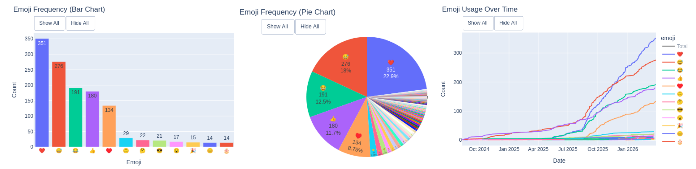

# 🎭 Emoji Counter 📊

Extract and visualize emoji usage from chat messages.


## Try it out online: https://emoji-counter.onrender.com

## Features

- **Web-based file upload** to process chat exports directly in the dashboard
- **Multi-platform support**: Signal, WhatsApp, and Messenger
- **Extract emojis** from chat message files into a SQLite database
- **Convert chat exports** from WhatsApp and other formats to the supported format
- **Interactive dashboard** to explore emoji usage patterns
- **Multiple visualizations**: Bar chart, Pie chart, and Time series
- **Filter by user or chat** to analyze specific conversations
- **Multi-database support** to combine and compare data from different sources
- **Cumulative time series** showing emoji usage growth over time

## Installation
Clone the repository and navigate to the project directory:

```bash
git clone https://github.com/simonthor/emoji-counter.git
cd emoji-counter
```

The easiest way to install it is using [uv](https://docs.astral.sh/uv/):

```bash
uv sync
```

Otherwise, you can create a virtual environment and install the dependencies manually:

```bash
python -m venv .venv
source .venv/bin/activate  # On Windows: .venv\Scripts\activate
pip install .
```

## Usage

### Quick Start: Upload via Web Interface

The simplest way to get started is to use the web-based file upload feature:

1. Launch the dashboard with no database files:
   ```bash
   emoji-explore
   ```

2. Open your browser to [http://127.0.0.1:8050](http://127.0.0.1:8050)

3. In the dashboard, you'll see an "Upload Chat Data" section where you can:
   - Select your chat format (Signal, WhatsApp, or Messenger)
   - Drag and drop or click to upload your `.zip` file
   - The system will automatically extract, process, and display the data

4. The chart will update automatically once processing is complete

### Traditional Workflow: Command-Line Tools

If you prefer using command-line tools or need more control over the process, follow these steps:

### 1. Prepare Message Files

The program supports message exports from Signal, WhatsApp, and Messenger platforms.

#### Signal Messages (via sigtop)

The program supports the output format from [sigtop](https://github.com/tbvdm/sigtop/), which is a tool to extract messages from Signal desktop. To install and run `sigtop`, follow the instructions in their repository.

`sigtop` will create a directory with text files containing the messages from each chat:
```
messages/
├── FirstName1 LastName1 (phone number or unique ID).txt
├── FirstName2 LastName2 (phone number or unique ID).txt
├── Group Chat (unique ID).txt
...
```

Each file contains messages in the following format:
```
Conversation: FirstName1 LastName1 (unique ID)

From: FirstName1 LastName1 (unique ID)
Type: incoming
Sent: Tue, 13 Aug 2024 09:30:41 +0200
Received: Tue, 13 Aug 2024 14:45:13 +0200

Lorem ipsum... 😄

From: You
Type: outgoing
Sent: Fri, 4 Oct 2024 17:53:47 +0200

consectetur adipiscing elit... 🤔
```

#### WhatsApp Messages

You can get your WhatsApp chat messages by following the instructions [here](https://faq.whatsapp.com/1180414079177245/). 
Make sure to export the chats without media for easier processing.
Unfortunately, WhatsApp only allows one to export one chat at a time, so if you want to analyze multiple chats, you will need to export each of them separately.
Blame Meta, not me 😓

You can then convert them to the supported format using the `message-convert` tool:

```bash
# Convert a single WhatsApp export
message-convert -i "WhatsApp-chatt med John Doe.txt" -o "converted/John Doe (Whatsapp).txt" \
    --your-name "Your Name" \
    --name-pattern "WhatsApp-chatt med %s"

# Convert all WhatsApp exports in a directory
message-convert -i whatsapp_exports/ -o converted/ \
    --your-name "Your Name" \
    --name-pattern "WhatsApp-chatt med %s"
```

**Options:**
- `-i, --input` (required): Input file or directory containing WhatsApp exports
- `-o, --output` (required): Output file or directory for converted files
- `--your-name`: Your display name in WhatsApp (messages from you will be marked as "You")
- `--name-pattern`: Pattern to extract chat name from filename using `%s` as placeholder
  - For Swedish WhatsApp: `"WhatsApp-chatt med %s"`
  - For English WhatsApp: `"WhatsApp Chat with %s"`
  - Custom patterns like `"Chat_%s_export"` are also supported

**Note:** When converting a directory, output files are renamed to `{chat_name} (Whatsapp).txt` to distinguish the source.

WhatsApp exports typically have this format:
```
2025-06-05 19:42 - Alice: Hello there!
2025-06-05 20:12 - Bob: Hi Alice 🙏
```

The converter transforms this into the standard `sigtop` format used by this tool.

#### Messenger Messages

You can download your Messenger chat data from Facebook by following the instructions [here](https://www.facebook.com/download/your_information).

When downloading, make sure to select:
- **Format**: JSON
- **Date range**: All time
- **Information types**: Messages

The downloaded file will contain JSON exports of your Messenger conversations. You can process this directly using the web interface by uploading the `.zip` file, or use the `message-convert` tool from the command line:

```bash
# Convert a Messenger export directory
message-convert -i messenger_exports/ -o converted/
```

When using command-line conversion, Messenger JSON files are automatically processed and converted to the standard format. Output files are renamed to `{conversation_name} (Messenger).txt`.

### 2. Extract Emojis

Once you have the message files in the correct format, you can use the `emoji-extract` command to extract emojis from these files and save them to a SQLite database. This can be done on either a single file or an entire directory:

```bash
mkdir -p data # Not necessary, but recommended to keep things organized

# From a single file
emoji-extract -i messages/chat.txt -o data/emojis.sql

# From a directory of files
emoji-extract -i messages/ -o data/emojis.sql
```

**Options:**
- `-i, --input` (required): Input file or directory containing message files
- `-o, --output` (default: `./emojis.sql`): Output SQLite database file


### 3. Explore Data

Launch the interactive dashboard to visualize emoji usage:

```bash
# Single database
emoji-explore data/emojis.sql

# Multiple databases (combine Signal and WhatsApp data)
emoji-explore data/signal.sql data/whatsapp.sql
```

When multiple databases are provided, chat names are automatically suffixed with the database filename (e.g., "John Doe (signal)", "Alice (whatsapp)") to distinguish between sources.

**Options:**
- `db_paths` (required): One or more paths to SQLite databases created by the extractor
- `--port` (default: 8050): Port to run the Dash app on
- `--debug`: Enable debug mode

Then open your browser to http://127.0.0.1:8050

## Dashboard Features

### Chart Types

- **Bar Chart**: Shows total count for each emoji with individual colors
- **Pie Chart**: Shows proportional distribution of emoji usage
- **Time Series**: Shows cumulative emoji usage over time

### Filters

- **User**: Filter by a specific user or view everyone's emojis
  - When a chat is selected, only users in that chat are shown
- **Chat**: Filter by a specific chat or view all chats
  - When a user is selected, only chats where that user has messages are shown
- Filters update dynamically based on each other's selection

To show all the chats or all the users again, simply select the "Everyone" or "All chats" options in the dropdowns.

### Interactive Controls

- **Show All / Hide All**: Toggle visibility of all traces (unfortunately there is a bug in Plotly that prevents this from working properly for pie charts, but it works for the other charts)
- **Legend**: Click to toggle individual emoji visibility
- **Hover**: View detailed information for each data point

## Database Schema

The SQLite database contains a single `emojis` table:

| Column | Type | Description |
|--------|------|-------------|
| `emoji` | TEXT | The emoji character |
| `timestamp` | TEXT | ISO 8601 timestamp of the message |
| `username` | TEXT | Name of the user who sent the emoji |
| `chat_name` | TEXT | Name of the chat/conversation |

## Development

### Running Tests

```bash
uv run pytest
```

### Linting

```bash
uv run ruff check .
```

### Type Checking

```bash
uv run ty check .
```
